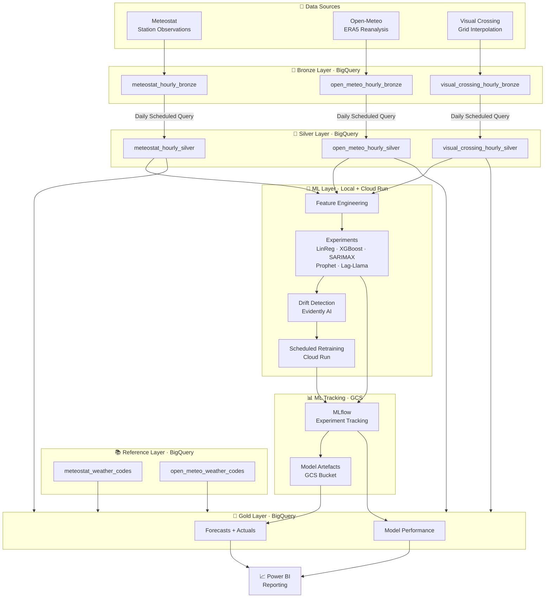

# Wedding Weather Pipeline

## 📋 Project Summary
A personal data engineering & data science project thats:
- ingests historical hourly weather data from my London-ish wedding venue into Google BigQuery to forecast the weather on D-Day.
- compares several time-serie forecast models and combine the most performing ones.
- compares the relevance of each datasource.
- analyse the importance of each feature.
- predict probability of rain and temperature profile on D-day

## 🎯 Objective 
Based on 20 years of hourly observations in my (outdoor) wedding venue, I want to output the probability distribution of weather conditions (rain and temperature) for mid-July?

## 🏗️ Architecture Overview


## 📊 Data Sources
3 sources providing historical data fetched from the web:
- Meteostat: Maintained python library providing historical observations by weather stations.
https://dev.meteostat.net/python
- Open-Meteo: Free online API available with mixed reanalysis data (ERA5) and interpolated data from nearby stations.
https://open-meteo.com/en/docs
- Visual Crossing: Free 1,000 API calls daily providing re-model signals only, on a 9km grid basis.
https://www.visualcrossing.com/weather-api

The type of historical data provided by each source are different (stations observation, interpolated data from nearby station (covers entire territory) and mixed) and are retrieved as such by design, to allow for comparison.

## 🔄 Pipeline Layers

Data ingestion and engineering:
- Big Query Bronze layer: Ingest raw, unmodified data from 3 datasources
- Big Query Silver layer: Convert datasources to the same units and feed into Machine Learning experiments. NULLS preserved as observed.
- Big Query Gold layer: Provide human-readable data for reporting (by joining reference tables for weather code descriptions), including the output of the ML retained design.

Data Science and inference:
- Each datasource is fed into experiment separately and combined.
- All models to be trained on calendar/cyclical features only (as opposed to lag features) due to the nature of desired prediction (probability distributions).
- Several models to be trained on 18-years train set and assessed individually on 2-years test set. Ensemble evaluated on test set; final inference ensemble restricted to best performing models.
    - Daily average baseline: The simplest form of prediction, climatological anchor.
    - Linear Regression: Multivariate, including feature relevance analysis and easily interpretable.
    - XGBoost: Capture non linear seasonal patterns.
    - SARIMAX: To isolate and extrapolate different level of patterns in the data (baseline, trend, seasonality) with relevant confidence intervals.
    - Prophet: Decomposes the time series into trend, multi-level seasonality, and noise. Queries learned seasonal patterns at any future date directly: it is the natural fit for climatological inference with long horizon window. Produces native uncertainty intervals.
- Models considered but rejected:
    - LSTM: the forecast horizon is long, the data I collected is quite limited (about 170k rows per weather data provider) so it is unlikely to make it in my final inference tool.
    - Lag-Llama: Current state of the art which probabilistic output suits this project but limited by univariate input (loose cross-variables relationships) and long forecast window. It is expected to underperform simpler models in this use case.
    - Temporal Fusion Transformer: Considered seriously as a multivariate, probabilistic, multi-horizon model that addresses the key limitations of Lag-Llama. Rejected on data volume grounds ( about 170k rows per source is insufficient to express TFT's advantage over simpler seasonal models) and implementation complexity disproportionate to marginal gain over Prophet + XGBoost ensemble at a 400+ day horizon.

## ⚙️ Technical Stack
- Python 3.13.13
- Google BigQuery
- Meteostat / Open-Meteo / Visual Crossing APIs
- Google Colab & Visual Studio Code
- Docker container
- ML Flow
- Cloud Run

## 🗂️ Repository Structure
```
wedding-weather-pipeline/
├── extractors/
│   ├── fetch_meteostat.py
│   ├── fetch_open_meteo.py
│   ├── fetch_visual_crossing.py
│   └── utils.py
├── logs/
├── backfill.py
├── config.py
├── create_bronze_tables.py
├── create_silver_tables.py
├── load_bronze.py
├── main.py
├── meteostat_weather_codes_mapping.csv
├── open_meteo_weather_codes_mapping.csv
├── run_pipeline.bat
├── run_vc_backfill.bat
├── vc_backfill_schedule.csv
├── vc_backfill_scheduled.py
├── requirements.txt
└── README.md
```

Note: ml/ folder is coming.

## 📈 Status
Data engineering:
- Bronze: Done
- Silver: Done
- Gold: Not started

Data Science:
- EDA: Not started
- Feature engineering:  Not started
- Models testing: Not started
    - Pure daily avg: Not started
    - Linear Regression: Not started
    - XGBoost: Not started
    - SARIMAX: Not started
    - Prophet: Not started
    - Lag-Llama: Not started
LSTM has been considered but dropped: my forecast horizon is long, the data I collected is quite limited (about 200k rows per weather data provider) so it is unlikely to make it in my final inference tool.
- Ensemble model: Final inference tool combining the best performing model using a non auto-regressive approach but learnt calendar/cyclical patterns.

## 🚀 Setup Guide
### Prerequisites
- Python 3.13
- GCP account with BigQuery enabled
- API keys: Visual Crossing (free tier)
- Google Cloud SDK installed
- Evidently AI (drift detection)

### Installation
pip install -r requirements.txt

### Authentication
- Windows: set GOOGLE_APPLICATION_CREDENTIALS=path/to/service-account.json
- Mac/Linux: export GOOGLE_APPLICATION_CREDENTIALS=path/to/service-account.json

### Running the pipeline
# Daily run
python main.py

# Backfill
python backfill.py

## 📝 Design Decisions
- Medallion architecture: current industry data engineering best practice.
- Silver layer: 
    - Keeps datasources separate as each one will fill in its own ML experiment. They will also be an experiment merging them to see which combination outputs the best results.
    - NULLS are NOT imputed in this layer as they are to be examined in the ML experiments part of the pipeline.
- Docker container chosen for project reproducibility as it's industry widest used tool as the time of the project.
- MLflow chosen over Vertex Experiments due to cost constraint.
- Cloud Run chosen for model retraining as this solution aligns with the "no costs/minimal cost" approach.
- Evidently AI for drift detection as it's open source, purpose-built for ML monitoring, and integrates natively with MLflow.